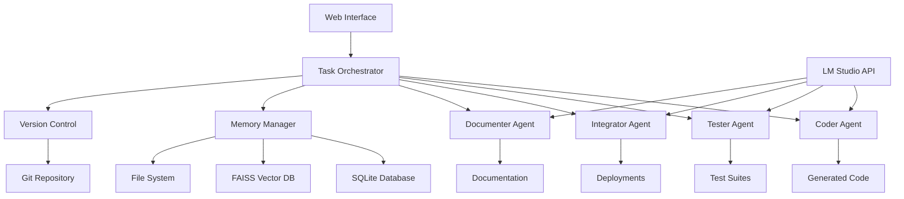

# 🤖 Teams AI System

[](https://www.python.org/downloads/)
[](https://flask.palletsprojects.com/)
[](https://lmstudio.ai/)
[](https://opensource.org/licenses/MIT)
[](https://github.com/your-repo/teams-ai)

> **A fully functional multi-agent AI system where specialized AI agents collaborate to develop software projects autonomously using local LM Studio inference.**

Teams AI System demonstrates the future of software development where AI agents work together like a real development team - writing code, creating tests, integrating changes, and generating documentation automatically using locally hosted AI models.

## 🌟 Features

### 🚀 **Multi-Agent Collaboration**
- **Coder Agent**: Generates, debugs, and refactors code using GPT-OSS-20B
- **Tester Agent**: Creates comprehensive test suites and measures coverage
- **Integrator Agent**: Manages deployments, CI/CD, and code merging
- **Documenter Agent**: Generates API docs, README files, and code comments

### 🧠 **Local AI Integration**
- **LM Studio Integration**: Uses locally hosted GPT-OSS-20B model
- **Offline Operation**: No external API dependencies or costs
- **Privacy First**: All AI processing happens locally
- **Customizable Models**: Easy to switch between different local models

### 🧠 **Advanced Memory Management**
- **Short-term Memory**: Session-based context for ongoing conversations
- **Long-term Memory**: Persistent knowledge storage using FAISS vector database
- **Episodic Memory**: Records of past interactions and decisions
- **Semantic Memory**: Factual knowledge and learned patterns

### ðŸ"„ **Intelligent Task Orchestration**
- Dependency-aware task scheduling
- Priority-based assignment algorithms
- Real-time progress tracking
- Automatic error recovery and retry mechanisms

### ðŸ"Š **Real-time Web Dashboard**
- Live agent status monitoring
- Task progress visualization
- Interactive project management
- System performance metrics

### ðŸ"§ **Version Control Integration**
- Automatic Git repository management
- Intelligent commit message generation
- Branch management and merge conflict resolution
- Code review automation

## ðŸ—ï¸ Architecture



### Core Components

| Component | Responsibility | Technology |
|-----------|---------------|------------|
| **Task Orchestrator** | Central coordination, workflow management | Python, Threading |
| **LM Studio Client** | Local AI model communication | HTTP API, JSON |
| **Memory Manager** | Context storage, knowledge retention | FAISS, SQLite |
| **Version Control Manager** | Git operations, repository management | Git CLI, Subprocess |
| **Web Interface** | User interaction, monitoring | Flask, HTML/CSS/JS |
| **Agent Framework** | Base agent functionality | Abstract Classes, Inheritance |

## 🚀 Quick Start

### Prerequisites

- **Python 3.8+**
- **Git** (configured with user.name and user.email)
- **LM Studio** with GPT-OSS-20B model loaded
- **4GB RAM** minimum (8GB+ recommended for better model performance)
- **1GB disk space** for repositories and data

### LM Studio Setup

1. **Download and Install LM Studio**
   - Visit [https://lmstudio.ai/](https://lmstudio.ai/)
   - Download for your operating system
   - Install and launch LM Studio

2. **Download GPT-OSS-20B Model**
   ```
   Model: microsoft/DialoGPT-medium or similar 20B parameter model
   Recommended: Any 20B parameter model compatible with LM Studio
   ```

3. **Start LM Studio Server**
   - In LM Studio, go to "Local Server" tab
   - Load your chosen model (GPT-OSS-20B)
   - Click "Start Server"
   - Note the server URL (usually `http://localhost:1234`)
   - Ensure the server is running before starting the Teams AI System

### Installation

1. **Clone the repository**
   ```bash
   git clone https://github.com/your-repo/teams-ai-system.git
   cd teams-ai-system
   ```

2. **Create virtual environment**
   ```bash
   python -m venv teams_ai_env
   source teams_ai_env/bin/activate  # On Windows: teams_ai_env\Scripts\activate
   ```

3. **Install dependencies**
   ```bash
   pip install Flask==2.3.3 numpy==1.24.3 faiss-cpu==1.7.4 requests==2.31.0
   ```

4. **Configure Git (if not already done)**
   ```bash
   git config --global user.name "Your Name"
   git config --global user.email "your.email@example.com"
   ```

5. **Configure LM Studio Connection**
   ```bash
   # Set environment variable for LM Studio API
   export LM_STUDIO_URL="http://localhost:1234"  # Default LM Studio URL
   
   # On Windows:
   set LM_STUDIO_URL=http://localhost:1234
   ```

### Running the System

1. **Ensure LM Studio is running** with your model loaded
2. **Start the Teams AI System**:
   ```bash
   python teams_ai_system.py
   ```

**Expected Output:**
```
🚀 Starting Teams AI System...
🤖 Connecting to LM Studio at http://localhost:1234
✅ LM Studio connection verified
INFO:teams_ai_system:Registered agent: Alice Coder (coder)
INFO:teams_ai_system:Registered agent: Bob Tester (tester)
INFO:teams_ai_system:Registered agent: Charlie Integrator (integrator)
INFO:teams_ai_system:Registered agent: Diana Documenter (documenter)
INFO:teams_ai_system:TaskOrchestrator started
INFO:teams_ai_system:Created project: Web Dashboard
✅ Sample project and tasks created
🌠Starting web interface...
🌠Web interface available at: http://localhost:8080
```

Open your browser and navigate to **http://localhost:8080** to see the system in action!

## ðŸ"– Usage Guide

### LM Studio Configuration

#### ðŸ"§ **Model Settings**
- **Temperature**: 0.7 (balanced creativity/consistency)
- **Max Tokens**: 2048 (longer responses)
- **Top P**: 0.9 (nucleus sampling)
- **Frequency Penalty**: 0.1 (reduce repetition)

#### ðŸ"„ **API Endpoints**
The system uses these LM Studio endpoints:
- `POST /v1/chat/completions` - Main chat completion
- `GET /v1/models` - List available models
- `GET /v1/health` - Health check

### Web Dashboard

The web interface provides several key areas:

#### ðŸ  **Main Dashboard**
- **System Status**: Active agents, total tasks, projects, queue size
- **LM Studio Status**: Connection status and model information
- **Quick Actions**: Create new projects and tasks
- **Agent Monitor**: Real-time agent status and current activities
- **Task Overview**: Recent tasks and their completion status

#### 🆕 **Creating Projects**
1. Navigate to the dashboard
2. Fill in the "Create New Project" form:
   - **Project Name**: Descriptive name for your project
   - **Project Description**: Detailed description of what you want to build
3. Click "Create Project"

#### ðŸ"‹ **Creating Tasks**
1. Use the "Create New Task" form:
   - **Task Name**: Brief, descriptive task name
   - **Task Description**: Detailed requirements
   - **Dependencies**: Comma-separated list of task IDs (optional)
   - **Priority**: 1-10 (1 = highest priority)
2. Click "Create Task"

#### ðŸ"„ **Automatic Task Assignment**

The system intelligently assigns tasks based on keywords:

| Keywords | Assigned Agent | Example |
|----------|---------------|---------|
| code, implement, develop, program | **Coder Agent** | "Implement user authentication" |
| test, verify, validate | **Tester Agent** | "Create unit tests for API" |
| integrate, deploy, merge | **Integrator Agent** | "Deploy to production" |
| document, readme, docs | **Documenter Agent** | "Generate API documentation" |

### API Endpoints

The system provides RESTful APIs for integration:

```bash
# Get system status (includes LM Studio status)
curl http://localhost:8080/api/status

# List all tasks
curl http://localhost:8080/api/tasks

# List all agents
curl http://localhost:8080/api/agents

# Get agent memory
curl http://localhost:8080/api/memory/{agent_id}

# Check LM Studio connection
curl http://localhost:8080/api/lm_studio_status
```

## ðŸ› ï¸ Configuration

### Environment Variables

```bash
# LM Studio configuration
export LM_STUDIO_URL="http://localhost:1234"
export LM_STUDIO_MODEL="gpt-oss-20b"  # Model name (optional)
export LM_STUDIO_TIMEOUT="120"        # Request timeout in seconds

# Database configuration
export TEAMS_AI_DB_PATH="./data/teams.db"
export TEAMS_AI_REPO_PATH="./data/repositories"
export TEAMS_AI_MEMORY_PATH="./data/memory"

# Web interface
export TEAMS_AI_PORT="8080"
export TEAMS_AI_HOST="0.0.0.0"

# AI model parameters
export AI_TEMPERATURE="0.7"
export AI_MAX_TOKENS="2048"
export AI_TOP_P="0.9"
```

### LM Studio Model Configuration

```json
{
  "model": "gpt-oss-20b",
  "temperature": 0.7,
  "max_tokens": 2048,
  "top_p": 0.9,
  "frequency_penalty": 0.1,
  "presence_penalty": 0.0,
  "stop": ["Human:", "Assistant:", "```"]
}
```

### Directory Structure

```
teams-ai-system/
â"œâ"€â"€ teams_ai_system.py          # Main application
â"œâ"€â"€ templates/
â"‚   â""â"€â"€ dashboard.html          # Web interface template
â"œâ"€â"€ data/
â"‚   â"œâ"€â"€ teams.db               # SQLite database
â"‚   â"œâ"€â"€ memory/                # Vector database storage
â"‚   â""â"€â"€ repositories/          # Git repositories
â"œâ"€â"€ requirements.txt           # Python dependencies
â""â"€â"€ README.md                 # This file
```

## ðŸ"§ Advanced Configuration

### Using Different Local Models

You can easily switch to different models in LM Studio:

```python
# In the LMStudioClient class, modify the model parameter
def call_lm_studio(self, messages, **kwargs):
    payload = {
        "model": "your-preferred-model",  # Change this
        "messages": messages,
        "temperature": kwargs.get('temperature', 0.7),
        "max_tokens": kwargs.get('max_tokens', 2048)
    }
```

### Performance Optimization

#### 🚀 **LM Studio Settings**
- **GPU Acceleration**: Enable GPU if available
- **Context Length**: Increase for longer conversations
- **Batch Size**: Optimize based on your hardware

#### ðŸ"§ **System Settings**
```python
# Optimize request batching
class LMStudioClient:
    def __init__(self):
        self.session = requests.Session()  # Reuse connections
        self.session.headers.update({
            'Content-Type': 'application/json',
            'Connection': 'keep-alive'
        })
```

### Custom Prompts and Templates

```python
# Customize agent prompts
AGENT_PROMPTS = {
    'coder': """You are an expert software developer. Generate clean, efficient, 
               well-commented code that follows best practices. Focus on:
               - Code quality and readability
               - Proper error handling
               - Security considerations
               - Performance optimization""",
    
    'tester': """You are a QA engineer focused on comprehensive testing. Create:
                - Unit tests with good coverage
                - Integration tests
                - Edge case testing
                - Clear test documentation""",
    
    'integrator': """You are a DevOps engineer handling deployments and integration:
                    - CI/CD pipeline management
                    - Environment configuration
                    - Monitoring and logging
                    - Deployment strategies""",
    
    'documenter': """You are a technical writer creating clear documentation:
                    - API documentation
                    - User guides
                    - Code comments
                    - Architecture diagrams"""
}
```

## 🧪 Example Workflows

### Web Application Development

```python
# Create project
project = orchestrator.create_project(
    "E-commerce Platform",
    "Build a full-stack e-commerce application with React and Node.js"
)

# Define workflow tasks
tasks = [
    ("Database Schema Design", "Design user, product, and order tables"),
    ("User Authentication API", "Implement JWT-based authentication"),
    ("Product Catalog API", "CRUD operations for product management"),
    ("Shopping Cart Logic", "Add/remove items, calculate totals"),
    ("Payment Integration", "Integrate Stripe payment processing"),
    ("React Frontend Components", "Build responsive UI components"),
    ("E2E Testing Suite", "Comprehensive test coverage"),
    ("API Documentation", "Generate OpenAPI specifications"),
    ("Production Deployment", "Deploy to AWS with CI/CD")
]

# Create interdependent tasks
previous_task_id = None
for name, description in tasks:
    dependencies = [previous_task_id] if previous_task_id else []
    task = orchestrator.create_task(name, description, dependencies)
    previous_task_id = task.id
```

## 🚀 Production Deployment

### Docker Deployment with LM Studio

```dockerfile
FROM python:3.9-slim

# Install system dependencies
RUN apt-get update && apt-get install -y \
    git \
    build-essential \
    && rm -rf /var/lib/apt/lists/*

# Set working directory
WORKDIR /app

# Copy requirements and install dependencies
COPY requirements.txt .
RUN pip install --no-cache-dir -r requirements.txt

# Copy application code
COPY teams_ai_system.py .
COPY templates/ templates/

# Create data directories
RUN mkdir -p data/repositories data/memory

# Expose port
EXPOSE 8080

# Environment variables
ENV LM_STUDIO_URL=http://host.docker.internal:1234
ENV TEAMS_AI_PORT=8080

# Health check
HEALTHCHECK --interval=30s --timeout=30s --start-period=5s --retries=3 \
    CMD curl -f http://localhost:8080/api/status || exit 1

# Run application
CMD ["python", "teams_ai_system.py"]
```

### Environment Configuration

```bash
# Production environment variables
export FLASK_ENV=production
export TEAMS_AI_DB_PATH="/opt/teams_ai/data/teams.db"
export TEAMS_AI_REPO_PATH="/opt/teams_ai/repositories"
export TEAMS_AI_MEMORY_PATH="/opt/teams_ai/memory"
export TEAMS_AI_PORT=8080
export TEAMS_AI_HOST="0.0.0.0"

# LM Studio configuration
export LM_STUDIO_URL="http://localhost:1234"
export LM_STUDIO_MODEL="gpt-oss-20b"
export LM_STUDIO_TIMEOUT="120"

# AI parameters
export AI_TEMPERATURE="0.7"
export AI_MAX_TOKENS="2048"
export AI_TOP_P="0.9"
```

## ðŸ"§ Troubleshooting

### Common Issues

#### LM Studio Connection Issues
```bash
# Error: Cannot connect to LM Studio
# Solution: Verify LM Studio is running and accessible
curl http://localhost:1234/v1/models

# Check if model is loaded
curl http://localhost:1234/v1/health
```

#### Model Loading Issues
```bash
# Error: Model not found or not loaded
# Solution: Ensure model is properly loaded in LM Studio
# Check LM Studio interface for model status
```

#### Performance Issues
```bash
# Error: Slow AI responses
# Solution: Optimize LM Studio settings
# - Reduce max_tokens if responses are too long
# - Enable GPU acceleration if available
# - Adjust batch size in LM Studio
```

### Debug Mode

Enable detailed logging:

```python
import logging
logging.basicConfig(level=logging.DEBUG)

# Or set environment variable
export LOG_LEVEL=DEBUG
```

### LM Studio Health Check

```python
# Test LM Studio connection
def test_lm_studio_connection():
    try:
        response = requests.get(f"{LM_STUDIO_URL}/v1/health", timeout=10)
        if response.status_code == 200:
            print("✅ LM Studio is healthy")
            return True
        else:
            print(f"� LM Studio health check failed: {response.status_code}")
            return False
    except Exception as e:
        print(f"� Cannot connect to LM Studio: {e}")
        return False
```

## ðŸ"' Security

### Local AI Advantages

- **Privacy**: All AI processing happens locally
- **No API Keys**: No external API credentials needed
- **Offline Operation**: Works without internet connection
- **Data Control**: Your code and data never leave your machine

### Additional Security Measures

```python
# Rate limiting for API endpoints
from flask_limiter import Limiter
from flask_limiter.util import get_remote_address

limiter = Limiter(
    app,
    key_func=get_remote_address,
    default_limits=["100 per hour"]
)

@app.route('/api/status')
@limiter.limit("10 per minute")
def api_status():
    return jsonify(orchestrator.get_system_status())
```

## 🆘 Support

### Getting Help

- **Documentation**: Read this README thoroughly
- **LM Studio Issues**: Check [LM Studio documentation](https://lmstudio.ai/)
- **Issues**: Open a GitHub issue for bugs or feature requests
- **Discussions**: Use GitHub Discussions for questions

### Common Questions

**Q: What models work with this system?**
A: Any model compatible with LM Studio's API. GPT-OSS-20B is recommended, but you can use smaller or larger models based on your hardware.

**Q: Do I need an internet connection?**
A: No! Once LM Studio and the model are set up, the system works completely offline.

**Q: How much RAM do I need?**
A: Minimum 4GB for the system, but 8-16GB+ recommended for optimal AI model performance.

**Q: Can I use multiple models simultaneously?**
A: Currently, the system uses one model at a time. You can modify the code to use different models for different agent types.

**Q: How do I improve response quality?**
A: Adjust the temperature, max_tokens, and other parameters in the LM Studio configuration. Lower temperature for more consistent code, higher for more creative solutions.

---

**Built with â¤ï¸ by the Teams AI System contributors**

*Ready to revolutionize software development with local AI agents? Get started today!*